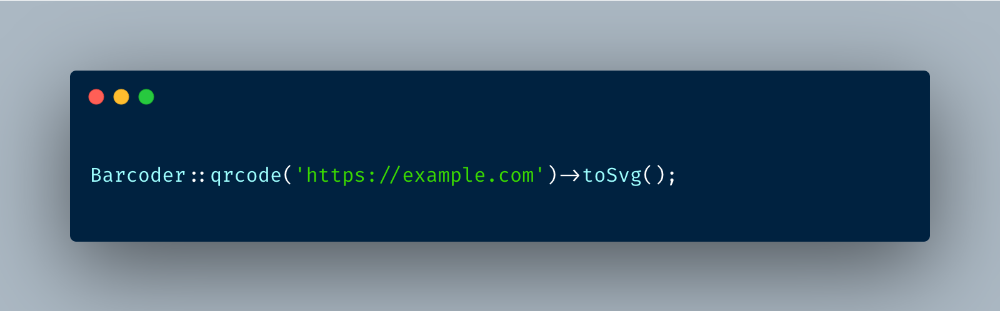

<p align="center"></p>

A classy package to generate barcodes in Laravel.

[](https://packagist.org/packages/adamgaskins/barcoder)
[](https://github.com/adamgaskins/barcoder/actions?query=workflow%3ATests+branch%3Amaster)
[](https://packagist.org/packages/adamgaskins/barcoder)

## Installation

You can install the package via composer:

```bash
composer require adamgaskins/barcoder
```

## Usage

See below for a full list of supported barcode types.

#### QR Code
```php
Barcoder::qrcode('data to encode')->toSvg();
```

#### Datamatrix
```php
Barcoder::datamatrix('data to encode')->toSvg();
```

#### Code 128
```php
Barcoder::code128('data to encode')->toSvg();

Barcoder::code128('data to encode')->hideLabel()->toSvg();
```

#### EAN-8
```php
Barcoder::ean8('12345678')->toSvg();

Barcoder::ean8('12345678')->hideLabel()->toSvg();

// check digit will automatically be calculated
Barcoder::ean8('1234567*')->toSvg();
```

#### EAN-13
```php
Barcoder::ean8('1234567890123')->toSvg();

Barcoder::ean8('1234567890123')->hideLabel()->toSvg();

// check digit will automatically be calculated
Barcoder::ean8('123456789012')->toSvg();
```

#### UPC-A
```php
Barcoder::upca('123456789012')->toSvg();

Barcoder::upca('123456789012')->hideLabel()->toSvg();

// check digit will automatically be calculated
Barcoder::upca('12345678901')->toSvg();
```

#### UPC-E
```php
Barcoder::upce('123456')->toSvg();

Barcoder::upce('123456')->hideLabel()->toSvg();

// check digit will automatically be calculated
Barcoder::upce('12345')->toSvg();
```

## Testing

```bash
composer test
```

## Changelog

Please see [CHANGELOG](CHANGELOG.md) for more information on what has changed recently.

## Contributing

Please see [CONTRIBUTING](.github/CONTRIBUTING.md) for details.

## Security Vulnerabilities

Please review [our security policy](../../security/policy) on how to report security vulnerabilities.

## Credits

- [Adam Gaskins](https://github.com/AdamGaskins)
- [All Contributors](../../contributors)

## License

The MIT License (MIT). Please see [License File](LICENSE.md) for more information.
