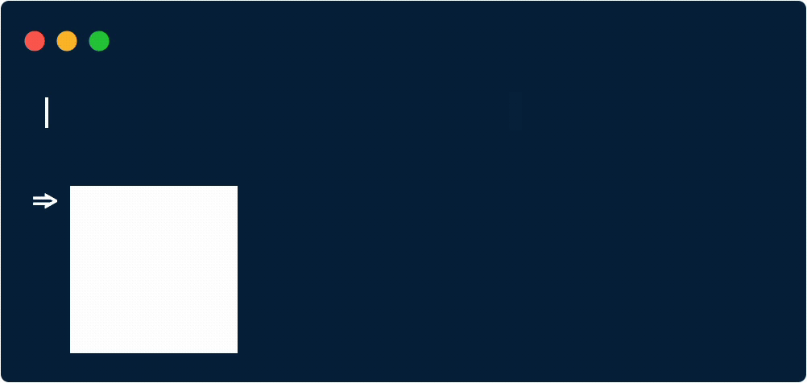

<p align="center"><a href="https://github.com/AdamGaskins/barcoder" alt="Barcoder on Github"></a></p>

<p align="center">A classy package to generate SVG barcodes for the web.</p>

<p align="center">
    <a href="https://packagist.org/packages/adamgaskins/barcoder" alt="Latest Version on Packagist"></a>
    <a href="https://github.com/adamgaskins/barcoder/actions?query=workflow%3ATests+branch%3Amaster" alt="GitHub Tests Action Status"></a>
</p>

<p align="center"><a href="https://github.com/AdamGaskins/barcoder" alt="Barcoder on Github"></a></p>

## Installation

You can install the package via composer:

```bash
composer require adamgaskins/barcoder
```

## Usage

See below for a full list of supported barcode types.

#### QR Code
```php
Barcoder::qrcode('data to encode')->toSvg();
```

#### Datamatrix
```php
Barcoder::datamatrix('data to encode')->toSvg();
```

#### Code 128
```php
Barcoder::code128('data to encode')->toSvg();

Barcoder::code128('data to encode')->hideLabel()->toSvg();
```

#### EAN-8
```php
Barcoder::ean8('12345678')->toSvg();

Barcoder::ean8('12345678')->hideLabel()->toSvg();
```

#### EAN-13
```php
Barcoder::ean8('1234567890123')->toSvg();

Barcoder::ean8('1234567890123')->hideLabel()->toSvg();
```

#### UPC-A
```php
Barcoder::upca('123456789012')->toSvg();

Barcoder::upca('123456789012')->hideLabel()->toSvg();
```

#### UPC-E
```php
Barcoder::upce('123456')->toSvg();

Barcoder::upce('123456')->hideLabel()->toSvg();
```

## Testing

```bash
composer test
```

## License

The MIT License (MIT). Please see [License File](LICENSE.md) for more information.
